# EPAM_DE_course_spark_practice_task
EPAM DE course spark practice task

Link to github where all code are stored:
https://github.com/sultanbekuly/EPAM_DE_course_spark_practice_task

## Project Overview
This project involves creating a Spark ETL (Extract, Transform, Load) job to integrate restaurant and weather data. The primary tasks include checking restaurant data for null values in latitude and longitude, geocoding these values using the OpenCage API, generating a geohash, and joining the weather and restaurant data using this geohash.

## Prerequisites
To run this project, you need:
- Apache Spark
- Python 3.x
- Required Python libraries: `pyspark`, `requests`, `geohash2`, `geopy`

You can install the Python libraries using:
pip install -r requirements.txt

Set up the necessary environment variables for the OpenCage API key:
- Linux:
  ```
  export OPEN_CAGE_API_KEY='your_api_key'
  ```

## Running the Application
To run the Spark job, execute the `main.py` script:
```bash
python main.py
```

## Testing
Tests are written using Python's `unittest` framework. To run the tests, execute the `test.py` script:
```bash
python test.py
```

## Structure
- `main.py`: The main Spark ETL job script.
- `test.py`: Contains unit tests for the project.
- `requirements.txt`: Lists all the necessary Python libraries.
- `raw/`: Contains raw data files.
- `df_enriched_<timestamp>/`: Output directories with the joined and enriched data.

## Screenshots
### Main file execution outputs
Used some prints (abc-z) for ease of understanding codes execution.

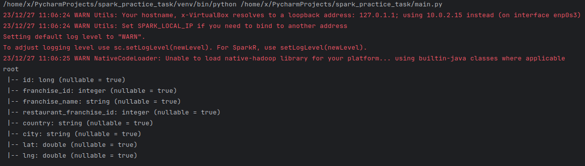
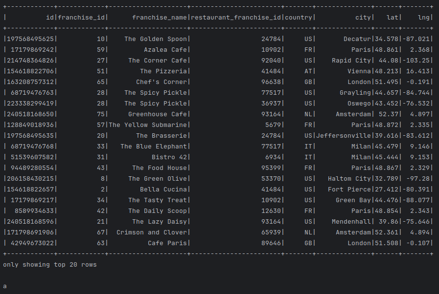
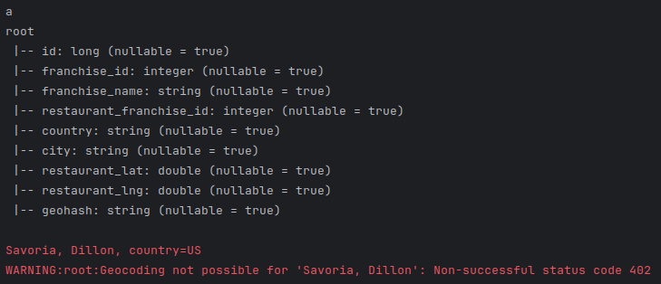
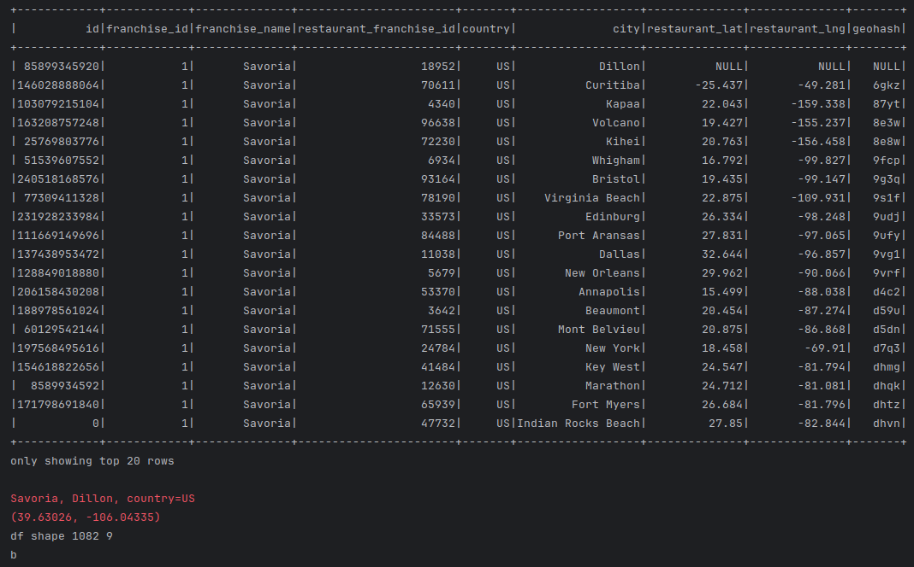
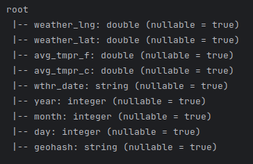
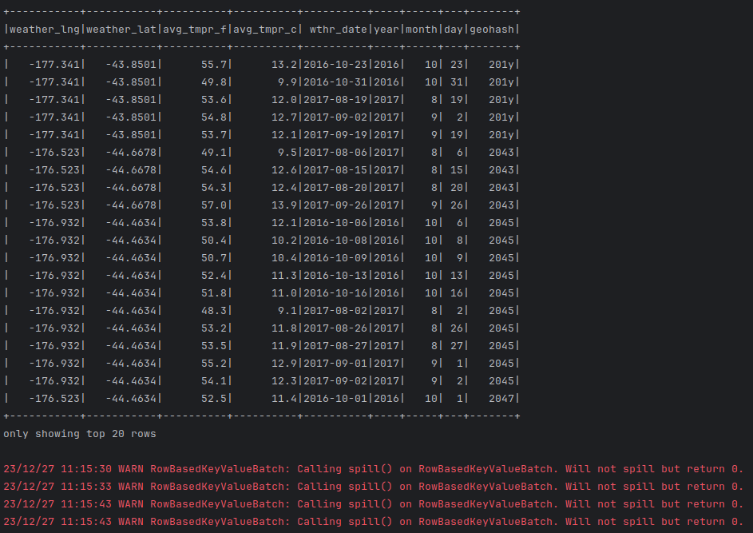
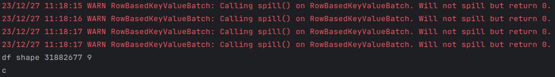
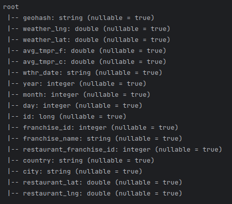
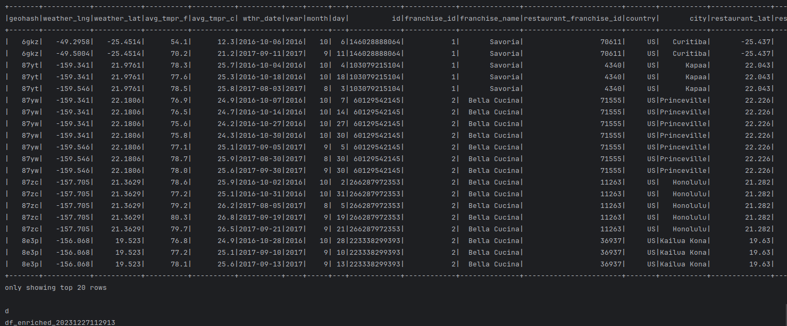
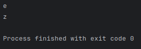

### Enriched files folder structure is as in source
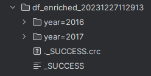
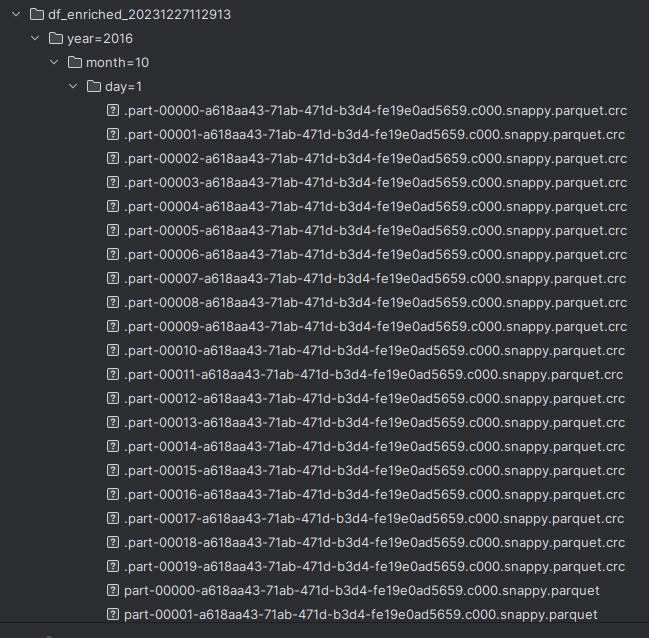

### Tests exution output
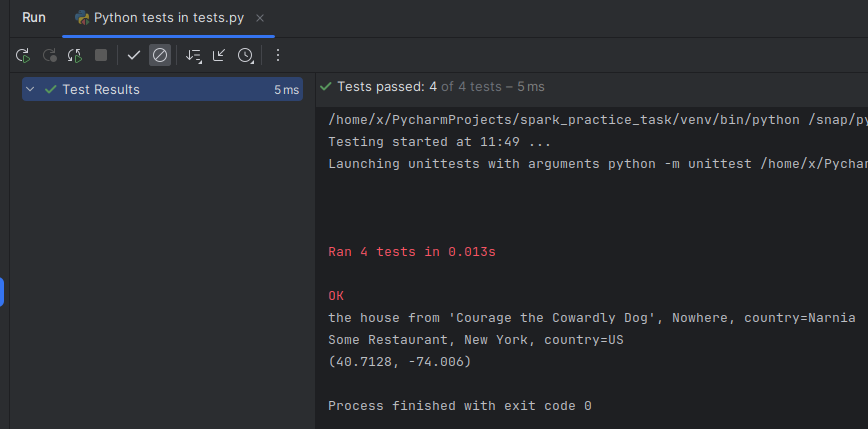

## Author
- Chingiz Nazar


The used api key is disabled.